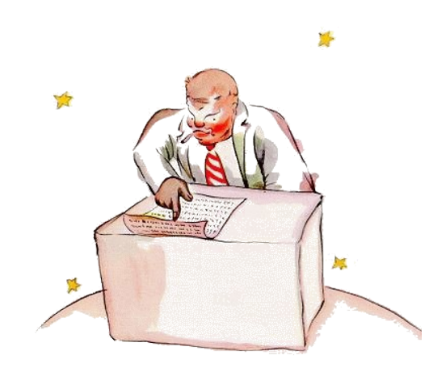

# 13

Li quaresim planete esset li planete del comerciante. Ti mann esset tant ocupat, que il ne adminim levat li cap quande li litt prince arivat.

"Bon die", li litt prince dit a il. "Vor cigarette ha extintet."

"Tri e du es quin. Quin e sett es deci-du. Deci-du e tri es deci-quin. Bon die. Deci-quin e sett es duantdu. Duantdu e six es duantott. Yo ne have témpor por accender it denov. Duantsix e quin es
triantun. Uf! Dunc to fa quincent un milliones sixcent duantdu mill settcent triantun."

"Quincent milliones de quo?"

"Qualmen? Tu es ancor ci? Quincentun milliones de ... yo ne save it plu ... yo have tant mult labor!

Yo es un seriosi mann, yo ne ocupa me pri infantilesses. Du e quin es sett ..."

"Quincentun milliones de quo?", li litt prince repetit. Il nequande in li vive abandonat un question, quel il ha unvez posit.

Li comerciante levat li cap.

"In li quinantquar annus, in queles yo habita sur ti planete, yo esset solmen trivez trublat. Li unesim vez esset ante duantdu annus quande un melolont hat cadet de úcunc a bass. It fat un terribil bruida e yo ha fat un addition con quar errores. Li duesim vez esset ante deciun annus. It esset un atacca de reumatisme. It manca a me movida.Yo ne have li témpor por flanar. Yo es un seriosi mann. E nu it es ja li triesim vez! Dunc yo di quinantcentun milliones ..."

"Milliones de quo?"

Li comerciante comprendet que il ne havet un chance por pace.

"Milliones de ti litt coses, queles on quelcvez vide in li ciel."

"Moscas?"

"Ma no, li litt coses queles brillia."

"Apes?"

"Ma no. Litt aurin coses per queles li fa-necoses deveni revosi. Yo es un seriosi mann. Yo ne have li témpor por reveríes."

"Ah, li stelles?"

"Dunc ili es li stelles."

"E quo tu fa con quincent milliones stelles?"

"Quincentun milliones sixcent duantdu mill settcent triantun. Yo es un seriosi mann, yo es tre exact."

"E quo tu fa con ti stelles?"

"Quo yo fa con ili?"

"Yes."

"Nequó. Yo possede les."

"Esque tu possede li stelles?"

"Yes."

"Ma yo ha ja videt un rey, qui .."

"Li reyes ne possede, ili 'regna súper" alquó. To es un totmen altri cose."

"E in quel maniere tu profita de to?"

"To fa me rich."

"E in quel maniere tu profita de esser rich?"

"Yo posse comprar pluri stelles si alquí trova alqueles."

Ti-ci hom, li litt price dit a se self, pensa un poc quam mi trincard.

Támen il posit ancor pluri questiones.

"Qualmen on posse posseder stelles?"

"A qui ili apartene?", li comerciante replicat morosimen.

"Yo ne save. A nequí."

"Tande ili apartene a me, yo ha pensat a to quam unesim."

"Esque to sufice?"

"Certmen. Si tu trova un diamant quel apartene a nequí, tande it es li tui. Si tu trova un insul quel apartene a nequí, talmen it es li tui. Si tu have quam unesim person un idé e tu patenta it, tande it es li tui. E yo, yo possede li stelles, pro que nequí ante me ha pensat pri posseder les."

"To es ver", li litt prince dit. "E quo tu fa con ili?"

"Yo administra les. Yo conta les denov e denov", li comerciante dit. "To ne es facil. Ma yo es un seriosi mann."

Li litt prince ancor ne esset satisfat.

"Si yo have un silkin chal, yo posse voluer it circum mi col e prender it con me. Si yo have un flor yo posse colier it e prender it con me. Ma tu ne posse colier stelles!"

"No, ma yo posse posir les in li bank."

"Quo significa to?"

"To significa que yo scri li númere de mi stelles sur un litt papere. E poy yo clude ti papere in un tirbux."

"E to es omnicos?"

"To sufice."

To es amusant, li litt prince pensat. It es quasi poetic. Ma on ne posse egarda it quam totmen seriosimen.

Li litt prince pensat pri li seriosi aferes totmen altrimen quam li grand homes.

"Yo," il ancor dit. "Yo possede un flor, quel yo arosea chascun die. Yo possede tri vulcanes, queles yo balaya chascun semane. Nam yo anc balaya li extintet vulcan. On save nequande. It es bon por mi vulcanes e por mi flor que yo possede les. Ma tu have null utilitá por li stelles ..."

Li comerciante apertet li bocca, ma il ne trovat un response e li litt prince desaparit.

Li grand homes es vermen tre strangi, il dit a se durant su viage.

