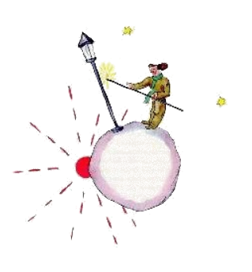

# 14

Li quinesim planete esset tre strangi. It esset li minim de omnicos. Li spacie just sufice por un stradlaterne e un accendero del laterne. Li litt prince ne posset se explicar pro quo on besona un
stradlaterne e un accendero del laterne alcú in li ciel sur un planete sin dom e sin habitantes. Ma il dit a se self:

It es tre probabil que ti mann es un poc alienat. Ma il ne es min alienat quam li rey, li vanitoso, li comerciante e li trincard. Adminim su labor have un sense. Si il accende su laterne, it es quasi quam il crea un nov stelle o un flor sur li munde. Si il extinte su laterne, tande li stelle o laterne indormi. To es vermen un jolli ocupation. It es anc vermen util, pro que it es jolli.

Quande il arivat sur li planete, il salutat li accendero del laterne honorabilmen.

"Bon die. Pro quo tu ha just extintet tui laterne?"

"Yo have li instruction por it", li accendero del laterne respondet. "Bon die."

"Quo es to, 'li instruction'?

"Li instruction extinter mi laterne. Bon véspere."

E il accendet it denov.

"Ma pro quo tu ha accendet it just nu denov?"

"To es li instruction", li accedero del laterne respondet.

"Yo ne comprende", li litt prince dit.

"To es nequó que on deve comprender", li accendero del laterne dit. "Li instruction es just li instruction. Bon die."

E il denov extintet li laterne.

Poy il siccat se su fronte per un rubi-quadrillat nas-linette.

"Yo fa ci un terribil servicie. Ante quelc témpor it esset plu rasonabil. Yo extintet in li matine e accendet in li véspere. Yo posset reposar li reste del die e yo posset dormir in li reste del nocte... "

"E desde tande li instruction esset changeat?"

"Li instruction ne esset changeat", li accendero del laterne dit. "To es exactmen li tragedie! Li planete ha rotat se chascun annu plu e plu rapidmen e li instruction ha restat li sam!"

"E?", li litt prince dit.

"E nu, pro que it fa in un minute un complet rotation, yo ne have plu un seconde de repose. Chascun minute yo accende unvez e yo extinte unvez!"

"To es amusant! Li dies che te dura un minute!"

"To tot ne es amusant", li accendero dit.

"Noi conversa nu ja un mensu con unaltru."

"Un mensu?"

"Yes, triant minutes. Triant minutes! Bon véspere!"

E il accendet denov li laterne.

Li litt prince regardat le e il amat ti accendero, qui esset tant fidel a su instruction. Il memorat li descensiones del sole pri queles il se ocupat plu tost per que il movet su fotel. Il volet auxilar su amico.

"Esque tu save ... yo conosse un mesura per quel tu vell posser reposar te, si tu vell voler ... "

"Yo vole sempre", li accendero dit.

Nam on posse esser fidel e pigri in li sam témpor.

Li litt prince continuat:

"Tui planete es tam litt que tu posse ear circum it per tri saltas. Tu solmen deve ear solmen suficent lentmen por restar sempre in li sole. Si tu vole restar, tande tu ea ... e li die va durar tam long quam tu vole."

"To ne es un grand amusament", li accendero dit, "to quo yo ama in li vive, es li dorme."

"In ti casu it es sin chances."

"Sin chances", li accendero dit. "Bon die."

E il extintet su lampe.

Ti mann, li litt prince dit a se, durant il continuat su viage, il va esser despreciat de omni altris, del rey, del vanitoso, del trincard e del comerciante. Ma il es li sol person, qui yo ne egarda quam risibil. Fórsan pro que il ocupa se pri altri coses in vice pri se self. Il sospirat pro regrete e ancor dit a se self:

Il es li sol, qui yo vell har posset far a mi amico. Ma su planete es vermen tro litt. Ne hay suficent spacie por du ...

To quo li litt prince ne audaciat admisser a se esset que il regretat que il ne posset restar sur ti benedit planete, precipue pro li mill quarcent quarant descensiones del sole in duantquar hores!

