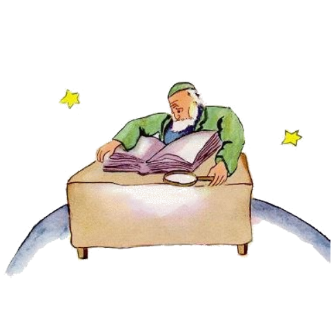

# 15

Li sixesim planete esset decivez tant grand. It esset habitat de un old senior, qui scrit imensi libres.

"Vi! Un explorator!", il vocat quande il videt li litt prince qui sedentat se al table e reposat se un poc. Il viageat ja tant mult!

"De u tu veni?", li old senior questionat le.

"Quo es to, ti-ci spess libre?", li litt prince dit. "Quo vu fa ci?", li litt prince dit.

"Yo es geograf", li old senior dit.

"Quo es to, un geograf?"

"To es un erudito qui save u li mares, li cités, li montes e li desertes es situat."

"To es tre interessant", li litt prince dit. "Finalmen un ver profession!"

Il regardat circum se al planete del geograf. Il nequande hat videt un tal majestosi planete.

"It es tre tre bell, vor planete. Esque it hay ci anc oceanes?"

"Yo ne posse saver to", li geograf dit.

"Ah!" Li litt prince esset deceptet. "E montes?"

"Yo anc ne posse saver to", li geograf dit.

"Ma vu es geograf! - E cités e fluvies e desertes?"

"Yo ne posse saver anc to."

"Ma vu ya es geograf!"

"Corect", li geograf dit, "ma yo ne es un explorator. It totmen manca a noi exploratores. It ne es li geograf qui ea por contar li cités, fluvies, montes, mares, oceanes e li desertes. Li geograf es tro important por vagar. Il ne forlassa su scri-table. Ma il recive li exploratores solemnimen. Il interroga les e il nota se lor impressiones. E si li noticies de un explorator sembla a il remarcabil, li geograf fa examinar oficialmen li moralitá de ili."

"Pro quo to?"

"Pro que un explorator qui menti posse causar catastrofes in li geografie-libres. E anc un explorator qui trinca tro mult."

"Qualmen to?", li litt prince dit.

"Pro que trincardes vide omnicos duplic. Li geograf vell dunc registrar du montes u existe solmen un."

"Yo conosse un person", li litt prince dit, "qui vell esser un mal explorator. "

"To es possibil. Ma si li moralitá de un explorator sembla esser bon, on fa un examination de su decovrition."

"Esque on ea a ti loc por controlar?"

"No. To es tro complicat. Ma on demanda del explorator que il livera pruvas. Si it acte se por exemple pri un grand monte, on demanda que il aporta con se grand lápides."

Subitmen li geograf excitat se:

"E tu, tu veni de un distant loc! Tu va descrir me tui planete!"

E li geograf apertet su registre-libre e acutat su crayon.

In prim on nota li narrationes del explorator per un crayon. Por scrir les con incre on atende til li explorator ha liverat pruvas.

"Nu?", li geograf questionat.

"O che me in hem", li litt prince dit, "ne eveni mult, pro que it es tre micri. Yo have tri vulcanes e un extintet. Ma on nequande save it."

"On nequande save", li geograf dit.

"Yo anc have un flor."

"Noi ne nota li flores", li geograf dit.

"Pro quo to? Ili es lu max bell!"

"Pro que li flores es passageari."

"Quo significa 'passageari'?"

"Li geografie-libres", li geograf replicat, "es li max valorosi de omni libres. Ili nequande inolda. It es tre rar que un monte cambia su loc. It es tre rar que un ocean perdi su aqua. Noi registra li eterni coses. "

"Ma li extintet vulcanes posse denov avigilar se?"

"Ca li vulcanes es extintet o activ, it es li sam", li geograf dit. "To quo es important por noi, to es li monte. It ne muta se."

"Ma quo significa 'passageari'?, repetit li litt prince, qui in su vive ancor nequande hat renunciat de un unvez posit question.

"To significa que it es menaciat de un bentost desaparition."

"Esque mi flor es menaciat del bentost desaparition?"

"Certmen."

Mi flor es passageari, li litt prince dit a se self e it have solmen quar spines por defender se contra li munde! E yo ha lassat it retro totmen sol!

To esset su prim emotion de repentie. Ma il retrovat denov su corage.

"Quo vu recomanda me a u yo deve ear?", il questionat.

"Al planete Terra", li geograf respondet, "it have un bon reputation ..."

E li litt prince departet e pensat a su flor.

