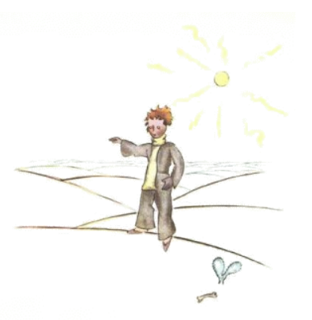

# 16

Li settesim planete dunc esset li Terra. Li Terra ne es alcun planete! On conta ta cent e deciun reyes, si on ne oblivia li reyes del negros, sett mill geografes, nincent mill comerciantes, sett e un demi million vanitosi homes, curtmen dit - circa du milliardes adult homes.

Por dar vos un idé pri li grandore del Terra, yo deve dir vos que on havet ta ante li invention del electricitá sur omni continentes un tot armé de quarcent sixantdu milles e quincent deci-un accenderos del laternes in servicie.

Videt de un quelc distantie to havet un magnific efecte. Li movementes de ti armé esset executet tam quam un ballett del ópera. Li accenderos del laternes de Nov-Zeland e Australia comensat li
rond-dansa. Quande ili hat accendet su laternes, ili eat dormir. Tande li accenderos del laternes de China e Siberia comensat su dansa. E anc ili desaparit detra li culisses. Tande li accenderos del
laternes de Russia e India esset sur li scene. Poy tis de Africa e Europa. Pos to tis de Sud-America. Poy tis de Nord-America. E ili nequande errat se in li órdine. It esset grandiosi. Solmen li accendero del sol laterne in li nord-pol e su colego del sol laterne in li sud-pol vivet plen de ociositá e comfortabilitá. Ili laborat duvez in li annu.

