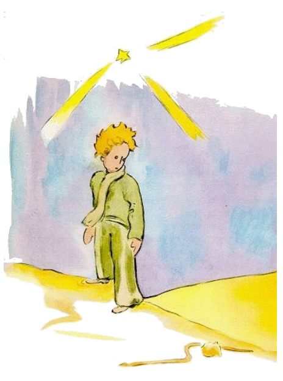

# 17

Si on vole esser espiritosi, tande it eveni que on fanfarona un poc. Yo ne esset totmen sinceri quande yo narrat vos pri li accenderos del laternes. Yo es li in li dangere que yo da a tis, qui ne conosse nor planete, un fals image de it. Li homes usa solmen tre poc del spacie sur li Terra. Li du milliardes habitantes, qui popula li Terra, vell stantar se verticalmen e un poc strettmen apu unaltru quam in un reunion populari, ili vell haver facilmen suficent spacie sur un public plazza con un longore de duant milies e un largore de duant milies. On vell posser assemblar li homanité sur li minim insul
del Pacific Ocean.

Li grand homes ne va vos creder to. Ili imagina que ili besona mult spacie. Ili prende se tam seriosi quam li baobab-árbores. Da les li consilie que ili deve calcular to self! Ili adora li ciffres, to va
pleser les. Ma vu ne deve perdir vor témpor per to. It es sin sense. Vu have confidentie a me.

Unvez sur li Terra li litt prince astonat se que il videt nequí. Il ja timet que il errat se in li planete quande un lunicolori anelle movet se in li sand.

"Bon nocte", li litt prince dit sin plan.

"Bon nocte", li serpent dit.

"Sur quel planete yo ha cadet?", li litt prince questionat.

"Sur li Terra, tu es in Africa", li serpent respondet.

"Ah! ... dunc nequí es sur li Terra?"

"Ci es li deserte. In li desertes es nequí. Li Terra es grand", li serpent dit.

Li litt prince sedentat se sur un lápide e levat li ocules al ciel.
"Yo questiona me", il dit, "ca li stelles brillia por que chascun posse un die retrovar li su. Regarda a mi planete. Il sta súper noi ... Ma it es tant distant.

"It es bell", li serpent dit. "Quo tu vole far ci?"

"Yo have problemas con un flor", li litt prince dit,

"A!", li serpent dit.

E ili tacet.

"U es li homes?", li litt prince finalmen continuat. "On es un poc solitari in li deserte ..."

"On es anc solitari che li homes", li serpent dit.

Li litt prince regardat longmen al serpent.

"Tu es un drolli animale", il dit finalmen, "tenui quam un fingre ... "

"Ma yo es plu potent quam li fingre de un rey", li serpent dit.

Li litt prince devet subrider.

"Tu ne es tre potent ... Tu ne adminim have pedes ... Tu ne adminim posse viagear."

"Yo posse portar te plu lontan quam un nave", li serpent dit. It rulat se circum li maleol del litt prince quam un aurin brasselette.

"Ti qui yo tucha, yo da le retro in li terra ex quel il ha originat", it ancor dit.

"Ma tu es pur, tu veni de un stelle ... "

Li litt prince respondet nequó.

"Yo regretta te que tu es sur ti Terra ex granite, tu qui es tant debil. Un die yo posse auxiliar te, si tu desira te tro ardentmen a tui planete. Yo posse ... "

"O, yo ha comprendet tre bon", li litt prince dit, "ma pro quo tu parla sempre in enigmas?"

"Yo solve les omnes", li serpent dit.

E ili tacet.

