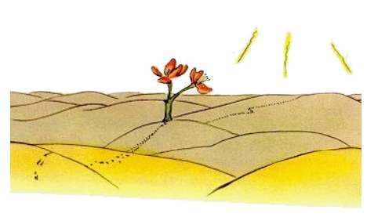

# 18

Li litt prince transeat li deserte e incontrat solmen un flor con tri petales, un tre miseri flor ...

"Bon die", li litt prince dit.

"Bon die", li flor dit,

"U es li homes?", li litt prince questionat politmen.

Li flor hat videt un die un passant caravane.

"Li homes? Yo pensa que it hay six o sett. Yo ha videt les ante quelc annus. Ma on nequande save u on posse trovar les. Li vente forsoffla les. Ili ne have radicas, to es tre mal por ili."

"Adío", li litt prince dit.

"Adío", li flor dit.

