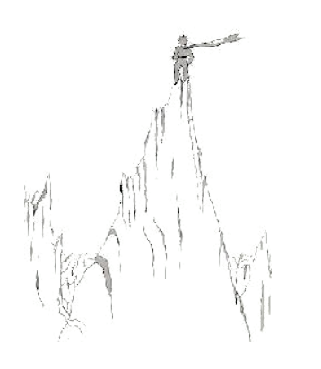

# 19

Li litt prince grimpat ad supra un alt monte. Li sol montes, queles il conosset, esset li tri vulcanes e ili esset tam bass quam su genú. E il usat li extintet vulcan quam taburette.

De un tal tant grand monte, il dit a se self, yo va strax vider li tot planete e omni homes ... Ma il videt nequó except li agullies de acut roccas.

"Bon die", il dit sin plan.

"Bon die ... Bon die... Bon die...", li ecó respondet.

"Qui es tu?", li litt prince dit.

"Qui es tu ... Qui es tu ... Qui es tu...?", li ecó respondet.

"Ples esser mi amico, yo es solitari", il dit.

"Yo es solitari ... solitari ... solitari...", li ecó respondet.

Qual strangi planete! - il pensat. It es totmen arid, plen de puntas e totmen salosi. E it manca li fantasie al homes. Ili repeti to quo on di a ili ... In hem yo havet un flor: It parlat sempre in prim ...

