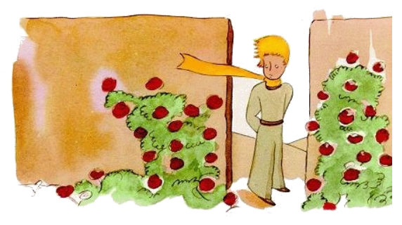
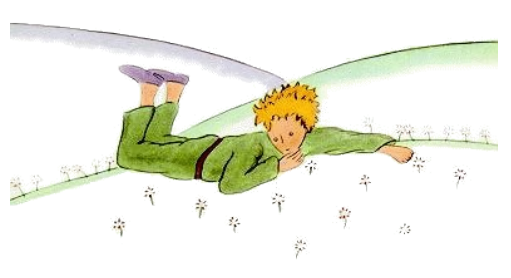

# 20

Ma pos li litt prince hat longmen migrat súper li sand, li roccas e li nive, it evenit que il finalmen decovrit un strada. E omni stradas ducte al homes.

"Bon die", il dit.

Ta esset un florescent jardin de rosieros.

"Bon die", li roses dit.

Li litt prince regardat a ili. Ili omnes similat a su flor.

"Qui vu es?", il questionat les tre astonat.

"Noi es roses", li roses dit.

"Ah!", li litt prince dit.

E il sentit se tre ínfelici. Su flor hat narrat le que it es sur li tot munde li sol de su specie. E vi! Ci esset quin milles de it, omnes identic, in un sol jardin.

Su flor vell esser tre furiosi si it vell vider to. E it vell tussar terribilmen e simular que it vell morir por evitar li risibilitá.

E yo vell dever simular si yo cuida me pri it, nam si ne it vell far que it vermen mori, por ahontar me ...

Tande il dit ancor a se self: Yo credet que yo vell esser rich per un unic rose e yo possede solmen un ordinari flor. It e mi tri vulcanes, queles es solmen tam alt quam mi genú e de queles un es fórsan extintet por sembre, to ne fa ex me un tre grand prince ... E il jettat se in li herbe e plorat.

