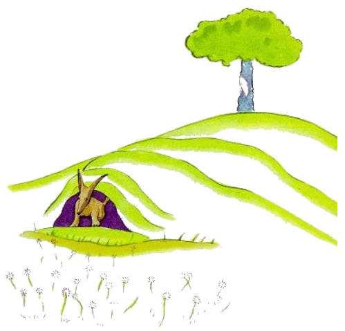
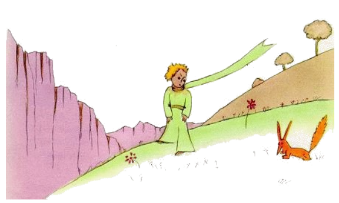

# 21

In ti moment aparit li fox.

"Bon die", li fox dit.

"Bon die", li litt prince respondet politmen e il tornat se, ma videt nequó.

"Yo es ci", li voce dit, "sub li pomiero ..."

"Qui es tu?", li litt prince dit. "Tu es tre jolli ... "

"Yo es un fox", li fox dit.

"Veni e lude con me", li litt prince proposit a il. "Yo es tant trist ..."

"Yo ne posse luder con te", li fox dit. "Yo ancor ne es amansat!"

"O, pardon!", li litt prince dit. Ma il addit pos quelc reflection.

"Quo significa 'amansar'?"

"Tu ne es de ci", li litt fox dit, "quo to sercha?"

"Yo sercha li homes", li litt prince dit. "Quo significa 'amansar'?"

"Li homes", li fox dit, "ili have fusiles e tira. To es molestant. Ili eleva gallines. To es lor sol interesse. Esque tu sercha gallines?"

"No", li litt prince dit, "yo sercha amicos. Quo significa 'amansar'?"

"Amansar es un cose quel on ha obliviat hodie", li fox dit. "It significa que 'on fa se confider'."

"Far se confider?"

"Certmen", li fox dit. "Tu es ancor por me nequó altri quam un litt púer, qui totmen simila a cent milles altri púeres. Yo ne besona te e tu ne besona me sam poc. Yo es por te solmen un fox, quel simila a cent milles altri foxes. Ma si tu amansa me, noi va necessitar unaltru. Tu va esser unic por me sur li munde. Yo va esser unic por te sur li munde ..."

"Yo comensa comprender", li litt prince dit. "It hay un flor ... yo crede que it ha amansat me ..."

"To es possibil", li fox dit. "On incontra omni possibil coses sur li terra ... "

"O, to ne es sur li terra", li litt prince dit.

Li fox semblat esser tre excitat.

"Sur un altri planete?"

"Yes."

"Esque it hay chassatores sur ti planete?"

"No."

"To es tre interessant! E gallines?"

"No."

"Nequó es perfect", li fox sospirat.

Ma li fox retornat a su pensa:

"Mi vive es monoton. Yo chassa gallines, li homes chassa me. Omni gallines simila unaltru e omni homes simila unaltru. Dunc yo enoya me un poc. Ma si tu amansa me mi vive va esser plen de sole. Yo va conosser li son de tui passu, quel difere se del omni altris. Li altri passus chassa me sub li terra. Ma tui passus va lurar me quam musica ex mi caverne. E tande regarda! Esque tu vide ta li
campes de frument? Yo ne manja pane. Por me li frument es ínutil. Li campes de frument memora me a nequó. E to es trist. Ma tui capilles es blond quam frument. O, it va esser marvelosi si tu va har
unvez amansat me! Li aure del campes de frument va memorar me a te. E yo va amar li bruida del vente in li frument. "

Li fox devenit mut e regardat longmen al litt prince.

"Ples ... amansar me!", il dit.

"Yo vermen vole to!", li litt prince respondet, "ma yo ne have tant mult témpor. Yo deve trovar amicos e yo vole conossentar mult coses."

"On save solmen li coses queles on amansa", li fox dit. "Li homes ne have plu témpor por conossentar alquó. Ili compra omnicos finit in li buticas. Ma pro que it ne hay buticas por amicos, li homes ne have plu amicos. Si tu vole haver un amico, tande amansa me."

"Quo yo deve far?", li litt prince dit.

"Tu deve esser patientosi", li fox respondet. "In prim tu sedenta te un poc distant de me in li herbe. Yo va regardar te un poc secretmen ex li angul del ocul e tu va dir nequó. Li lingue es li fonte de omni miscomprenses. Ma chascun die tu va sedentar te un poc plu proxim ..."

In li sequent matine li litt prince retornat.

"It vell esser plu bon si tu vell har retornat ye li sam clocca", li fox dit. "Si tu por exemple veni ye quar clocca in li posmidí, yo posse comensar esser felici ye tri clocca. Plu témpor passa plu felici yo va sentir me. Ye quar clocca yo va excitar me ja e desquitar me. Yo va experir quel valore li felicitá have. Ma si veni alquande, yo nequande va saver quande mi cordie deve esser ta. It es necessi que it hay fix customes."

"Quo significa 'fix customes'?", li litt prince dit.

"Anc alquó que on ha obliviat", li fox dit. "It es to per quo un die difere se de un altri, un hor del altri hores. It hay por exemple un custom che mi chassatores. Ili dansa chascun jovedí con li puellas
in li village. Pro to jovedí es un marvelosi die. Yo promena til li viniera. Si li chassatores vell ear alquande al dansa, omni dies vell esser egal. Yo nequande vell haver vacanties.

Talmen li litt prince fat li fox confider con se. E quande li hor del adío esset proxim:

"Ah!", li fox dit, "yo va plorar".

"To es tui culpa", li litt prince dit. "Yo ne desirat a te alquó mal, ma tu volet que yo amansa te ..."

"Certmen", li fox dit.

"Ma nu tu va plorar!", li litt prince dit.

"Certmen", li fox dit.

"Talmen tu ha ganiat nequó".

"Yo ha ganiat li color del frument", li fox dit.

Poy li fox addit:

"Ea denov regardar li roses! Tu va comprender que tui rose es unic in li munde. Tu va retornar e dir adío a me e yo va donar te un secrete.

Li litt prince foreat por revider li roses.

"Vu totmen ne simila a mi rose, vu ancor es nequó", il dit a ili. "Nequí ha fat se confidet a vu e anc vu ne ha fat vu confidet a nequí. Vu esset quam mi fox esset. It esset nequó quam un fox tam quam mill cent altris. Ma yo ha fat it a mi amico e nu it es unic in li munde.

E li roses esset tre ahontat.

"Vu es bell, ma vu es vacui", il ancor dit. "On ne posse morir por vu. Certmen, alquí person, qui passa, vell posser creder que mi rose es simil a vu. Ma in se self it es plu important quam vu omnes,
pro que it es li rose quel yo ha versat. Pro que it es li rose quel yo ha posit sub un vitre por protecter it. Pro que it es li rose quel yo ha protectet per un para-vente. Pro que it es li rose de quel erucas yo ha mortat (except du o tri pro li papiliones). Pro que it es li rose quel yo ha audit lamentar o laudar
se o anc quelcvez tacer. Pro que it es mi rose."

E il retornat al fox.

"Adío", il dit.

"Adío", li fox dit. "Ci es mi secrete. It es tre simplic: On vide solmen per li cordie bon. Lu essential es por li ocules ínvisibil".

"Lu essential es por li ocules ínvisibil", li litt prince repetit por amemorar it.

"Li témpor quel tu ha perdit por tui rose, it fa tui rose tant important. "

"Li témpor quel yo ha perdit ...", li litt prince dit por amemorar it.

"Li homes ha obliviat ti veritá", li fox dit. "Ma tu ne deve obliviar it. Tu es durant tui tot vive responsabil por to quo tu ha fat confider a te. Tu es responsabil por tui rose ..."

"Yo es responsabil por mi rose ...", li litt prince repetit por amemorar it.
