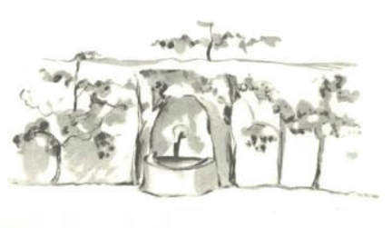

# 24

It esser ye li ottesim die pos mi panne in li deserte e yo just audit li narration pri li venditor de pillules quande yo trincat li ultim gutte de mi provision de aqua.

"Ah", yo dit al litt prince, "tui memories es tre jolli, ma yo ancor ne ha reparat mi avion. Yo ne have plu alquó por trincar e yo vell esser felici, si yo anc vell posser ear tre lentmen a un puteo!"

"Mi amico li fox", il dit ...

"Mi homette, it ne acte se plu pri li fox!"

"Pro quo?"

"Pro que on va morir pro sete ..."

Il ne comprendet mi objection, il respondet:

"It es bon, hat havet un amico, mem si on deve morir. Yo es felici que yo havet un fox quam amico ..."

Il ne posse judicar li dangere, yo dit a me self. Il nequande suffret fame e sete: Un poc de sole sufice por il ...

Ma il regardat a me e respondet a mi penses:

"Yo anc have sete ... lass nos serchar un puteo ..."

Yo fat un geste del desperantie, it es ínsensat, serchar sin plan un puteo in li deserte. Malgré to noi comensat li sercha.

Quande noi hat circumeat tacente por hores, li nocte iruptet e li stelles comensat lucer. Yo videt les tam quam in un somnie, yo havet un poc febre pro li sete.

Li paroles del prince dansat tra mi mente.

"Esque tu dunc have anc sete?", yo questionat le.

Il ne respondet a mi question.

Il simplicmen dit: "Aqua anc posse esser bon por li cordie ... "

Yo ne comprendet li paroles e tacet. Yo savet bon que on ne devet questionar le.

Il esset fatigat. Yo sedentat me apu il. E pos un tacentie il ancor dit:

"Li stelles es bell pro que ili memora me a un flor quel on ne vide ... "

Yo respondet: "Certmen", e yo regardat tacente li plicas del sand sub li lune.

"Li deserte es bell", il addit.

To es ver. Yo ha sempre amat li deserte. On sedenta se adsur un sand-dune. On vide nequó. On audi nequó. E durant to alquó brilliat in li silentie.

"It fa li deserte bell", li litt prince dit, "que it alcú cela un puteo."

Yo esset surprisat que yo subitmen comprendet li misteriosi splendore del sand. Quande yo esset un litt púer, yo habitat in un old dom e secun li legende esset un tresor celat in it. Certmen, nequande alquí ha posset decovrir it, fórsan nequí ha serchat it alquande. Ma it insorciat ti tot dom. Mi dom celat un secrete sur li suol de su cordie...

"Yes", yo dit al litt prince, "ca it acte se pri un dom, pri li stelles o pri li deserte. To quo causa su bellitá es ínvisibil!"

"Yo es felici",il dit, "que tu consenti con mi fox."

Pro que li litt prince indormit, yo prendet le in mi brasses e continuat denov li via. Yo esset emotionat. It semblat a me quam yo vell portar un fragil juvel. It semblat a me mem si it ne vell
exister alquó plu fragil sur li Terra. Yo regardat in li luce del lune ti pallid fronte, ti cludet ocules, ti in li vente trement capilles e yo dit a me:

"To quo yo vide ci es solmen un covritura. Li essentie es ínvisibil ..."

Pro que su demí-apertet labies indicat presc un subrise, yo anc dit a me: To quo emotiona me tant a ti litt indormit prince, esset su fide a un flor. It es li image de un rose quel radia tra il quam li
flamme de un lampe mem quande il dormi ... E il sembla a me ancor plu fragil quam til nu. On deve protecter li lampes cuidosimen: Un burasca posse far extinter les ... 

E durant yo continuat ear, yo decovrit in li aurora li puteo.

