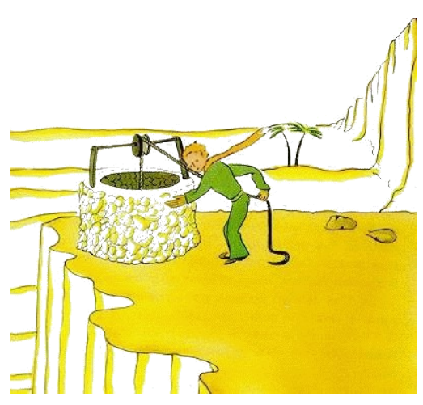

# 25

"Li homes", li litt prince dit, "presse se in trenes rapid, ma ili totmen ne save a u ili vole ear. Poy ili excita se e torna se in li circul ..." E il adjuntet:

"To ne vale li pena ..."

Li puteo, quel ili hat atinget, ne similat al puteos in li Sahara. Li puteos del Sahara es simplic in li sand fossat fores. Ti-ci similat a un puteo in un village. Ma it esset nequal village ci e yo pensat que yo reva.

"To es strangi", yo dit al lit prince, "omnicos es pret: li vind, li sitelle e li corde ..."

Il ridet, tuchat li corde e lassat li vind luder. E li rul cracat quam un old vent-rot si li vente ha dormit longmen.

"Tu escuta", li litt prince dit, "que noi avigila ti puteo e il canta ... "

Yo ne volet que il pena se tro mult.

"Lass me far to", yo dit a il, "to es tro pesant por te."

Yo levat lentmen li sitelle til li márgine del puteo. Yo posit it a ta tre rectmen. In mi oreles esset ancor li cantada del vind por tirar. E in li aqua, quel ancor tremet, yo videt li sole.

"Yo have sete a ti aqua", li litt prince dit, "da me it por trincar..."

E yo comprendet quo il hat serchat.

Yo levat li sitelle a su labies. Il trincat con cludet ocules. It esset quam un festa. Ti aqua esset alquó totmen altri quam un trincage. It originat ex li marcha sub li stelles, ex li cantada del rul e ex li pena de mi brasses. It esset bon por li cordie quam un don. Quande yo esset un púer li luces del cristnascentie-árbor, li musica del cristnascentie-messe e li suavitá del subrise esset li ver splendore del dones, queles yo recivet.

"Li homes che te in hem", li litt prince dit, "cultiva quin mill roses in un e li sam jardin ... malgré to ili ne trova ta to quo ili sercha ..."

"Ili ne trova it", yo respondet ...

"Ma on posse trovar to quo ili sercha in un sol rose o in un poc de aqua ..."

"Tre certmen", yo respondet.

E li litt prince adjuntet:

"Ma li ocules es ciec. On deve serchar con li cordie."

Yo hat trincat. It respira se denov plu bon. Li sand havet in li aurora li color de miel. Yo esset felici pri ti miel-color. Pro quo yo deve suciar me ...

"Tu deve tener tui promesse", li litt prince, qui hat sedet apu me, dit lenimen.

"Quel promesse?"

"Tu save it, un museliere por mi agne ... Yo es responsabil por ti flor!"

Yo prendet mi esquisses ex li tasca. Li litt prince videt it e dit ridente.

"Tui baobab-árbores aspecte un poc quam caules ... "

"O!"

E yo esset tant fier pri li baobab-árbores!

"Tui fox ... su oreles ... aspecte un poc quam cornes ... ili es mult tro long!"

E il ridet denov.

"Tu es ínjust, homette, yo posset dessiner nequó altri quam apert o cludet gigant-serpentes!"

"O! It va suficer", li litt prince, "nam li infantes save it."

Do yo scriachat un museliere. E li cordie convulset se in me quande yo dat it al litt prince:

"Tu have planes pri queles yo ne save ..."

Ma il ne respondet. Il dit:

"Tu save, mi cade al Terra ... Deman it va har esset exactmen ante un annu ... "

Poy, pos un tacentie, il ancor dit:

"Yo hat cadet a bass tre proxim..."

E il rubijat.

Yo sentit denov un strangi chagrine sin saver pro quo.

Ínterim yo havet un question:

"Esque tande it ne es un coincidentie que tu in li matine in quel yo connossentat te, ante ott dies, promenat totmen sol, mill miles distant de omni habitat regiones? Esque tu retornat al punctu a u tu hat cadet?"

Li litt prince rubijat ancor plu.

E il adjuntet hesitante:

"Fórsan it esset li anniversarie? ... "

Li litt prince rubijat denov. Il nequande respondet al questiones, ma si on rubija, tande to significa 'yes', ca ne?

"Uf", yo dit, "yo time me!"

Ma il respondet:

"Tu nu deve laborar. Tu deve retornar denov a tui machine. Yo va expectar te ci. Retorna deman in li véspere ... "

Ma yo ne esset tranquilisat. Yo memorat me pri li fox. On es in dangere que on plora un poc si on ha lassat se amansar ...

