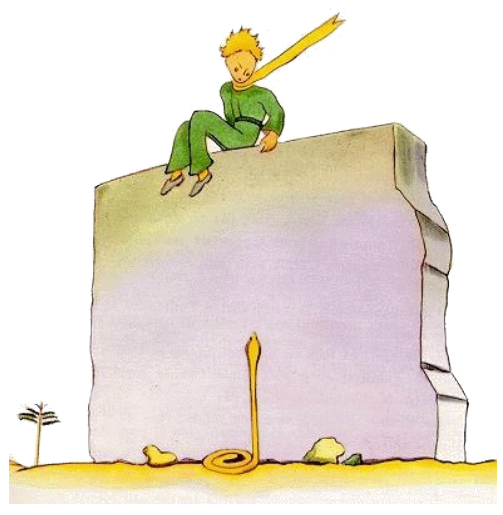
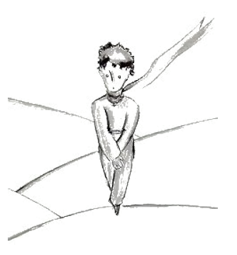
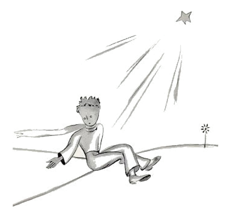

# 26

Apu li puteo stat li ruine de un old mur ex petre. Quande yo retornat in li sequent véspere de mi labor, yo videt ex li distantie que mi litt prince sedet sur it con pendent gambes. E yo audit le parlar.

"Do tu ne memora te plu?", il dit. "It es ne totmen exact ci!"

Sin dúbite un altri voce respondet a il, pro que il replicat:

"Ma yes! Ma yes! It es probabilmen li die, ma ne li exact loc ..."

Yo continuat mi via al mur. Yo videt e audit nequí. Támen li litt prince replicat denov:

"Certmen. Tu va vider u mi tracie comensa in li sand. Tu solmen besona expectar me ta. Ho-véspere yo va esser ta.

Yo esset duant metres distant del mur e yo ancor videt nequó. Li litt prince ancor dit, pos un curt tacentie:

"Esque tu have fort venen? Esque tu es cert que tu ne va lassar me longmen suffrer?"

Yo haltat e mi cordie convulset se in me, ma yo ancor ne comprendet it.

"Nu forea", il dit, "yo vole saltar de supra!".

Tande yo regardat al pede del mur e yo fat un salta! Ta hat erectet se un de ti yelb serpentes, queles posse mortar te in triant secondes, avan li litt prince ... Yo serchat in mi tasca por mi revólver e comensat currer. Pro li bruida quel yo fat, li serpent lassat se glissar lentmen in li sand quam un aqua-spruzza quel mori e sin tro grand hasta it glissat con un litt metallic rasle inter li lápides.

Yo atinget li mur exactmen in li just témpor por capter mi homette de un prince in mi brasses; il esset pallid quam nive.

"Qual coses tu fa ci? Esque tu nu parla con serpentes?!"

Yo hat desmettet le su chal quel esset yelb quam li sole. Yo hat humidat un poc su tempie e dat le alquó por trincar. E nu yo ne audacicat questionar le plu.

Il regardat a me seriosimen e mettet su brasses circum mi col. Yo sentit qualmen su cordie palpitat quam un de un morient avie, quel on ha fusilat.

Il dit a me:

"Yo es felici que tu ha trovat to quo esset damegeat in ti machine. Tu va posser retornar a hem ... "

"De u tu save to?"

Yo just hat volet narrar a il que mi labor hat successat in contrarie de mi tot expectation!

Il ne respondet a mi question, ma il continuat:

"Anc yo va hodie retornar a hem ... "

Tande melancolicmen:

"To es mult plu distant ... To es mult plu desfacil ... "

Yo bon sentit que alquó extraordinari evenit.

Yo inbrassat le fortmen quam un litt infante e malgré it semblat a me que il verticalmen cadet in un precipitie sin que yo posset retener le ...

Su regard esset seriosi; it perdit se in un tre grand lontanie.
"Yo have tui agne. E yo have li buxe por li agne. E yo have li museliere ... "

E il subridet melancolicmen.

Yo atendet tre longmen. Yo sentit que il calentar se plu e plu:
"homette tu hat timet ... "

Il hat timet, tre certmen! Ma il ridet lenimen:

"Yo va timer ho-véspere ancor mult plu ... "

Denov yo tre frissonat pro li sentiment del ínevitabil adío. Yo comprendet que yo ne posset tolerar li pense que yo ne va audir plu ti ride. It esset por me quam un puteo in li deserte.

"homette, yo vole audir te ancor rider."

Ma il dit a me:

"In ti nocte un annu va har passat. Mi stelle va esser exactmen súper li loc u yo ha aterrat in li passat annu ... "

"homette, esque it ne es un mal somnie, ti afere con li serpent e li consentiment e li stelle ... "

Ma il ne respondet a mi question.

Il dit: "On ne vide to quo es important ..."

"Certmen ... "

"To es li sam afere tam quam con li serpent: Si tu ama un flor, quel habita sur un stelle, tande it es bell regardar li ciel in li nocte. Omni stelles es plen de flores."

"Certmen ..."

"To es li sam tam quam con li aqua. To quo tu ha dat a me por trincar esset quam musica, li vind e li corde ... tu memora te ... it esset bon."

"Certmen ..."

"Tu va regardar li stelles in li nocte. Mi hem es tro micri por monstrar te u it es situat. It es plu bon in ti maniere. Mi stelle va esser por te un del stelles. Tande tu va regardar al stelles con plesura. ... Ili omnes va esser tui amicos. E tande yo va far te un don... "

Il ancor ridet.

"Ve! homette, homette! Yo audi ti ride con tant grand plesura!"

"Exactmen to va esser tui don ... It va esser li sam tam quam con li aqua ..."

"Quo tu vole dir?"

"Li homes have stelles, ma it ne es li sam stelles. Por li unes qui viagea li stelles es lor guideros. Por altris ili ne es alquó altri quam micri luces. Por quelc altris, li eruditos, ili es li problemas. Por mi comerciante ili esset aure. Ma omni ti stelles tace. Tu, tu va haver stelles, tam quam nequí have les ... "

"Quo tu vole dir?"

"Si tu regarda al stelles in li nocte it va esser por te tam quam li stelles ride pro que yo habita sur un de ili e pro que yo ride sur un de ili. Tu va esser li sol person quel have stelles queles posse rider!"

E il ridet denov.

"E si tu va har consolat te (on consola se sempre), tu va esser felici que tu ha conosset me. Tu va esser sempre mi amico. Tu va voler rider con me. E tu va aperter quelcvez li fenestre solmen pro
plesura ... E tui amicos va esser astonat quande il vide que tu regarda li ciel e ride. Tande tu va dir a ili: 'Yes, li stelles, ili fa me rider.' E ili va pensar que tu es alienat. Yo va har fat a te un bell joca ... "

E il ridet denov.

"It va esser tam quam yo vell har donat a te in vice del stelles mult litt tintinettes queles posse rider ..."

E il ancor ridet. Tande il devenit denov seriosi:

"Ti nocte ... tu save que it ... ne veni!"

"Yo ne va forlassar te."

"It va aspecter tam quam yo vell esser malad tam quam yo vell morir. It es talmen. Ne veni por regardar to, it ne vale li pena ... "

"Yo ne va forlassar te."

Ma il es tre suciat.

"Yo di it a te ... anc pro li serpent .. It ne deve morder te ... Li serpentes es maliciosi. Ili posse morder pro plesura ..."

"Yo ne va forlassar te."

Ma alquó tranquilisat le:

"It es ver, ili ne have plu venen por un duesim morsion ..."

Yo ne ha videt qualmen il departet in li nocte. Il escapat silentiosimen. Quande yo successat rejunter le, il marchat rapidmen con firm passus.

Il dit solmen:

"Bon, tu es ci ..."

E il prendet mi manu. Ma il ancor tormentat se:

"To ne es bon por te. It va far dolore a te. It va aspecter tam quam yo es mort e to ne va esser ver ..."

Yo tacet.

"Tu comprende. It es tro distant. Yo ne posse prender con me ti córpor. It es tro desfacil."

Yo tacet.

"Ma it va jacer sur li suol tam quam un old abandonat pelle. On ne deve esser trist pro tal old pelles ..."

Yo tacet.

Il perdit un poc li corage. Ma il efortiat se ancor:

"Tu deve saver, it va esser marvelosi. Anc yo va regardar li stelles. Omni stelles va esser puteos con un oxidat vind. Omni stelles va dar a me alquó por trincar ..."

Yo tacet.

"To va esser tant joyosi! Tu va haver quincent miliones tintinettes e yo va haver quincent miliones puteos ... "

E anc il tacet pro que il plorat ...

"Ta it es. Lass me far un passu sol."

E il sedentat se pro que il timet.

Il ancor dit:

"Tu save ... mi flor ... yo es responsabil por it! E it es tant debil! E it es tant infantil! It have quar spines queles ne es apt por protecter it contra li munde ... "

Yo sedentat me, pro que yo ne posset star plu.

Il dit:

"Ci ... To es omnicos ..."

Il hesitat ancor un poc, tande il levat se. Il fat un passu. Yo ne posset mover me plu.

It esset nequó altri quam un yelb fúlmine apu su maleol. Il restat un momente sin mover se. Il ne criat. Il cadet lentmen quam un árbor cade. Sin alcun bruida il cadet in li sand.

