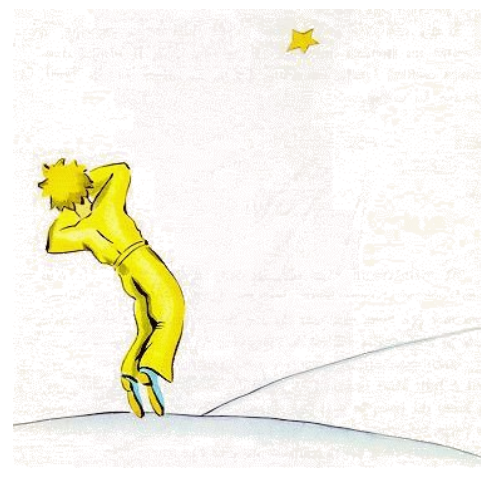

# 27

E nu ja six annus ha passat ... Yo ancor nequande ha narrat to. Li camarados, qui ha revidet me, esset felici. Yo esset trist, ma yo dit a ili que to es li exhaustion.

Nu yo ha consolat me un poc. To significa ... ne totmen. Ma yo save bon, que il ha retornat a su planete, nam in li comensa del matin yo ne ha retrovat su córpor. It ne esset un tant pesant córpor ...
E yo ama escutar al stelles in li nocte. Ili es quam quincent miliones tintinettes ...

E nu eveni alquó extraordinari.

Yo ha obliviat fixar un cutin strap al museliere, quel yo ha dessinat por li litt prince! Il ne va har successat metter it al agne.

Pro to yo questiona me: Quo ha evenit sur li planete? Fórsan li agne ha vermen manjat li flor ...

Quelcvez yo di a me: Certmen ne! Li litt prince covri su flor chascun nocte per un vitrine e il tre bon atente a su agne. Tande yo es felici. E omni stelles ride pianimen.

Ma quelcvez yo di a me: On es in quelc momentes ínatentiv e to sufice! Il ha obliviat in un véspere li vitrine o li agne ha escapat in un nocte sin far un bruida ... Tande omni tintinettes transforma se in lácrimes! ...

To es un tre grand secrete. Por vu, qui anc ama li litt prince, nequó sur li munde posse restar íntuchat, sam quam por me, si alcú, on ne save u, un agne, quel noi ne conosse, ha fórsan devorat un
rose o fórsan ne ha devorat it ...

Vu mey regardar li ciel. Questiona vos self: Esque li agne ha manjat li flor o ne? Yes o no? E vu va vider qualmen omnicos se transforma ...

Ma necun del grand homes va alquande comprender que to have un tant grand importantie!

