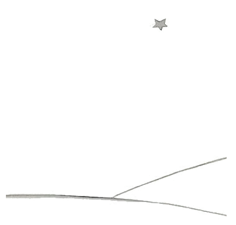

# Fin

To es por me li max bell e max trist paisage del munde. It es li sam paisage quam sur li precedent págine, ma yo ha dessinat it ancor un vez por fa it a vu tre clar. Ci ha aparit li litt prince sur li Terra
e ha denov desaparit. Regarda ti paisage tre exactmen por que vu certmen va reconosser it quande vu un die va viagear tra li african deserte. E si vu per hasarde passa tra ti paisage, ne hasta plu
lontan, yo implora vos – atende un poc, exactmen sub li stelle! Si tande un infante ea vers vu, si il ride, si il have aurin capilles, si il ne responde, quande on questiona le, tande vu va divinar qui es to. Tande ples esser tam bon e ne lassa me tant trist. Vu deve scrir a me rapidmen, si il ha retornat.

