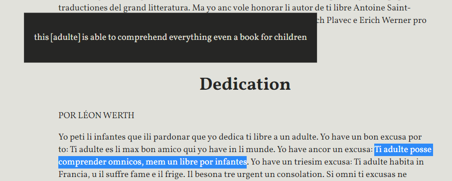

---

# Li Romance de Photogen e Nycteris

## (Li Yuno del Jorne e li Yuna del Nocte)

de George MacDonald – 1882

Traduction in Occidental (Interlingue): David MacLeod – 2019

---

### Usage

Iluminar un sol parol por vider un explication 

o iluminar mani paroles por vider un naiv traduction.

Selecter tui lingue preferet por li traductiones.

