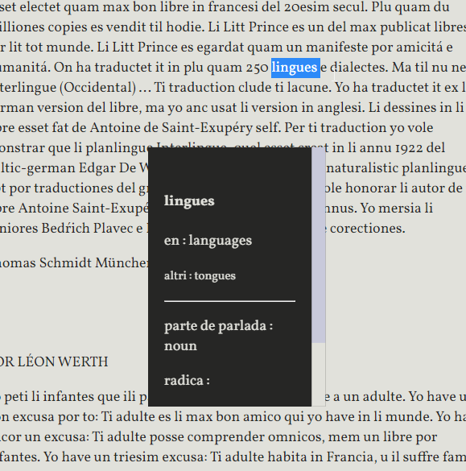

---

# Li Litt Prince

de Antoine de Saint-Exupéry

Traductet de Thomas Schmidt

---

### Usage

Iluminar un sol parol por vider un explication 

o iluminar mani paroles por vider un naiv traduction.

Selecter tui lingue preferet por li traductiones.

